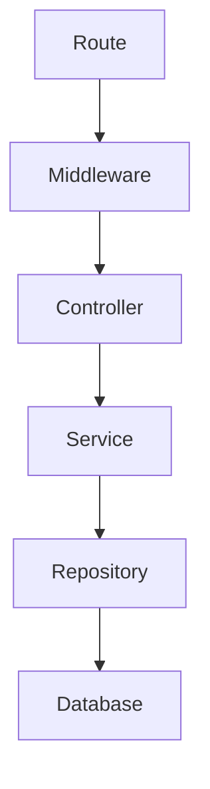
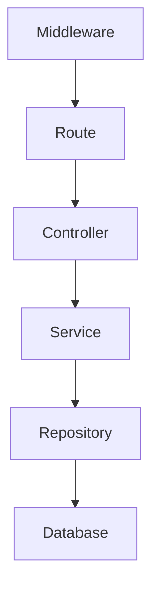
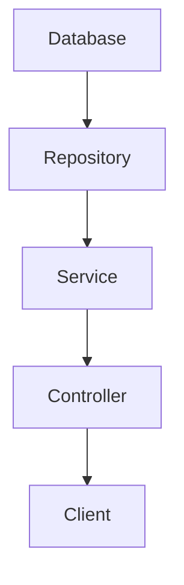

# Bot-Hunter BACKEND

This is the backend for the Bot-Hunter project. It is a REST API built with NodeJS and Express. It uses a MongoDB database.

## Installation

Using your favorite package manager, install the dependencies.

```bash
npm install
```
OR
```bash
yarn install
```

## Main Dependencies
- **MongoDB**: MongoDB is used for the database. You can download it [here](https://www.mongodb.com/).
- **Typescript**: Typescript is used for the project. You can download it [here](https://www.typescriptlang.org/download).
- **ExpressJs**: ExpressJs is the framework used for the API. You can download it [here](https://expressjs.com/).

## Getting Started

### Server Setup
You will need to create a `.env.*` file in the root directory of the project. The `.env.*` file should contain the following variables:

```bash
PORT=xxx
NODE_ENV=xxx
MONGO_URL=xxx
```

To run the project, use the following command:

```bash
npm run dev
```
OR
```bash
yarn dev
```
The `dev` script makes use of the `.env.development` file.
This implis you will need an env file for each environment you want to run the project in. Example: `.env.production` for production, `.env.staging` for staging, `.env.local` for local, etc.

PS: Dont forget to add the corresponding script in the `package.json` file.

### Client Setup
You will need to add this js tag to your website's entry point. For example, in the `index.html` file.
It should be added at the start or end of the body tag. It is loaded asynchronously.

```html
    <script>
      !(function (a, b, c, e, f) {
        f.bhOptions = e;
        var s = a.createElement(b),
          n = a.getElementsByTagName(b)[0];
        (s.async = 1), (s.src = c), n.parentNode.insertBefore(s, n);
      })(document, 'script', 'https://cdn.jsdelivr.net/gh/blvck237/bot-script@latest/evaluate.js', { endpoints: ['http://endpoint-to-protect-1', 'http://endpoint-to-protect-2'] }, window);
    </script>
```
The `endpoints` option is an array of endpoints to protect. You can add as many as you want. The js tag will protect all the endpoints you add.


## How it works

Bot detection is a complex process. It involves a lot of data processing and analysis. The process is divided into 4 main steps:
1. Data collection: Data is collected from the clients using the script in `scripts/bot-hunter.js`. Such as fingerprints, user agent, events, session duration and so on. This data is later sent to the server.
2. Data processing: The data is processed and cleaned. It is asserted and formatted and inserted in the database to make it easier to work with. 
3. Data analysis: Each request is analzed and scored based on the existing collected data and the new request data. The score is used to determine if the request is a bot or not.
4. Data intepretation: The result is later sent to the client. Based on this, the script realizes the appropriate action to take. For example, if the request is a bot, the script will block the request and display a captcha to the user.

The heart of this project is the `EvaluationService`. It contains the logic for the data analysis. It is where the score is calculated. This score is calculated based on the following criteria:
1. Fingerprint (20): Fingerprints are information or data collected by the javascript tag and sent to the server. This data is used to identify the user. Device fingerprints can be used to fully or partially identify individual devices even when persistent cookies cannot be read or stored in the browser, the client IP address is hidden, or one switches to another browser on the same device. They include:
    - User agent
    - Screen resolution
    - Timezone
    - Language
    - Plugins
    - Cookies
    - Local storage
    - Session storage
    - IndexedDB
    - WebSQL
    - Canvas
    - WebGL
    - WebRTC
    - Battery
    - Device memory
    - Hardware concurrency
    - Screen orientation
2. Flags (20): This is of warnings detcted by the tag sent to the server. E.g. Abnormal session duration or bounce rate.
3. Traffic (20): Number of requests made by the user in a given period of time. If the number of requests is too high, it is likely that the user is a bot.
4. Request headers (20): This is the data sent by the user in the request headers. E.g. 
   - User agent, referer, etc. Some bots can be identified by the user agent. For example, bots that use the Googlebot user agent. But we need to differentiate good bots from bad bots. This is because we cannot block all bots, which can be helpful for SEO. So we need to find a way to differentiate between good and bad bots.
   - Protocol: Any request made with the HTTP protocol is likely to be a bot
   - Connection: Any request made with the keep-alive connection is likely to be a bot
   - IP: We use the user's IP to check if it's a known blacklisted IP.
5. User's activity (20): This is the user's activity on the website. Basically, it's all about the user's behaviour. E.g.
   - Time spent on the website
   - Clicks
   - Mouse movements
   - Scroll
   - Keyboard events
   - Touch events
  Some bots can't reproduce some actions. For example, mouse movements, clicks, etc. So based on the user's activity, we can determine if the user is a bot or not.
6. Captcha (20*): Captcha resolution duration and retries are used to evaluate the user. It may be presented to user's whose activity pattern look alike with a bot's one. If a user resolves a captcha, he is allowed to continue browsing but we keep monitoring his activities to make sure there's no abnormal change in his behaviour. 

Below is a diagram representing the the detailed process of the bot hunter.
<!-- Insert image -->

1. The js tag analyzes and collects data from the client
2. The data is sent to the server
3. The server then processes it based on the criteria mentioned above and the existing data in the database. The evaluation is saved in the database.
4. The server requests some extra data from the database to finalize the evaluation. This data is used to determine if the user is a bot or not.
5. The result is sent back to the client. 
6. The js tag then takes the appropriate action based on the result.

Each request made by a client is evaluated and can be uniquely identified by the following data:
- IP
- Fingerprint Hash: This is an encrypted hash of the fingerprint data. It is unique for each user.

## File Structure
The file structure is as follows:

```bash
├── README.md
├── package.json
├── public
├── scripts
│   ├── bot-hunter.js
│   └── bot-hunter.min.js
├── src
│   ├── main.ts
│   ├── config
│   │   └── index.ts
│   ├── constants
│   │   └── xxx.ts
│   ├── controllers
│   │   └── xxx.controller.ts
│   ├── core
│   │   ├── exceptions
│   │   └── index.ts
│   ├── db
│   ├── factories
│   │   └── xxx.factory.ts
│   ├── middlewares
│   │   └── xxx.ts
│   ├── repositories
│   │   ├── base.repository.ts
│   │   └── xxx.repository.ts
│   ├── routes
│   │   ├── index.routes.ts
│   │   └── xxx.routes.ts
│   ├── services
│   │   └── xxx.service.ts
│   ├── types
│   │   └── xxx.ts
│   └── utils
│       └── date.ts
├── tsconfig.json
├── nodemon.json
└── package.json
```
- `src/main.ts`: This is the entry point of the project. It is where the server is initialized.
- `src/config`: This folder contains the configuration files for the project. The `index.ts` file contains the configuration for the project. It is where the environment variables are loaded.
- `src/controllers`: This folder contains the controllers for the project. The controllers are data is cleansed, asserted and passed to the services.
- `src/core`: This folder contains the core files for the project. The `index.ts` file contains the core files for the project. Every single resource needed for the project to run is initialized here.
- `src/middlewares`: This folder contains the middlewares for the project. The middlewares are used to validate, assert or format data before it is passed to the controllers.
- `src/routes`: This folder contains the routes for the project. The routes are used to define the endpoints for the project. The `index.routes.ts` file is where the routes are created and exposed. A route should always have a path as first argument and a controller as second argument. Example: 
 ```JavaScript
    this.router.post('/login', botController.killBot);
```
- `src/services`: This folder contains the services for the project. The services are used to define the business logic for each resouce. The services are where the data is processed and returned to the controllers.
- `src/types`: This folder contains the types for the project. The types are used to define the structure of the data that is used throughout the project. For example, the `user.ts` file contains the type for the user resource.
- `src/utils`: This folder contains the utility functions for the project. For example, the `date.ts` file contains the utility functions for the date resource.
- `tsconfig.json`: This is the typescript configuration filefor the compiler.
- `nodemon.json`: This is the nodemon configuration file for the project. Defines how the server should be launched or restarted.
- `package.json`: This is the package.json file for the project. It contains the dependencies and scripts for the project.
- `public`: This folder contains the static files for the project. For example, all the images and files that are uploaded to the server are stored here. These files are ignored by git.
- `script`: This folder contains the javascript script that will be loaded by the client. This script is used to collect data from the client and send it to the server. You will find a minified version of the script in this folder.

**NB**: _Respect this file structure. If you need to add a new file or folder, make sure it is in the right place._

## Data flow

### Incoming data flow:


### Outgoing data flow:


## Building the project
The project is built using the `build` command. This command is configured in the `package.json` file. To build the project, run the command
 ```bash
 npm run build
 ```
This will compile the typescript files into javascript files and store them in the `dist` folder. The `dist` folder is ignored by git. You will need to have a `.env.production` file in the root of the project for the build to work.


